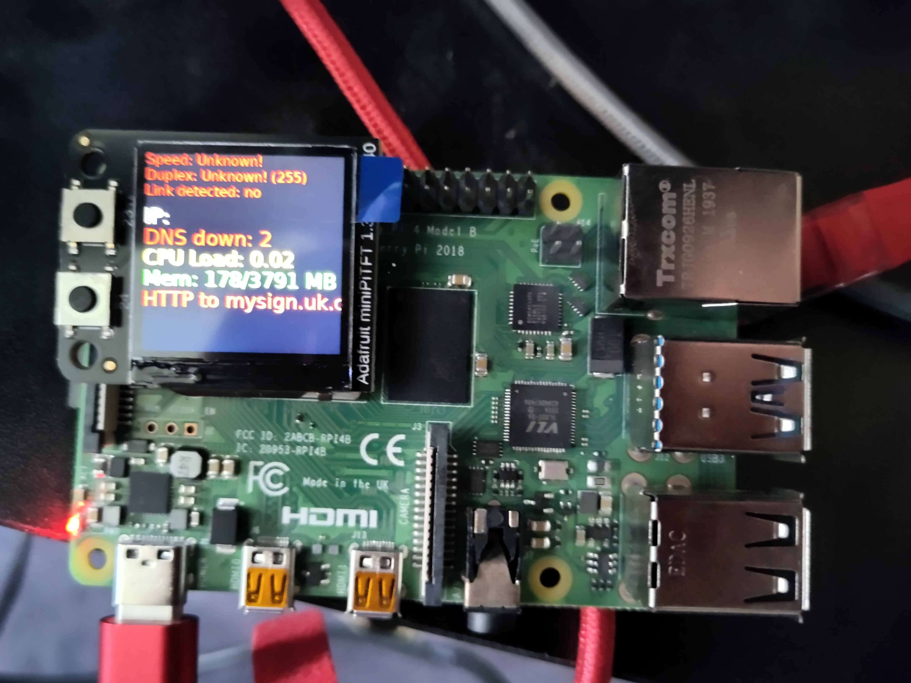
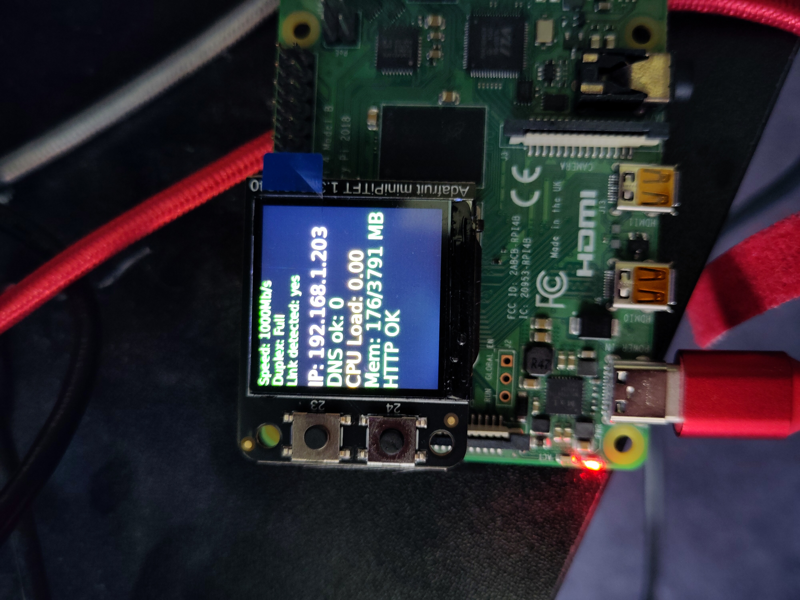

# minipitft_netdiagnostic
Network diagnostic screen for Adafruit PiTFT 240x240

Based on https://learn.adafruit.com/adafruit-mini-pitft-135x240-color-tft-add-on-for-raspberry-pi/python-setup

## Installation

- Enable SPI and I2C in the raspi-config menu.
- Enable autoboot to console in the raspi-config menu.
- Run installer.sh.

## Screenshots

